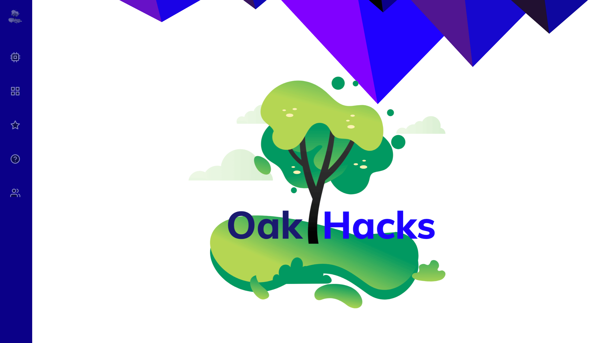

# Oakhacks

OakHacks is a virtual hackathon that specializes in technology, design and business. Hacking will begin on September the 12th and end on September the 13th.

# Getting started

#### Clone this repo by running: `git clone https://github.com/aasirvalji/Oakhacks.git`

#### Change directory to oakhacks: `cd Oakhacks`

#### Run app: `npm run start`

Runs the app in the development mode.

 

- Oakhacks 2020 ©
